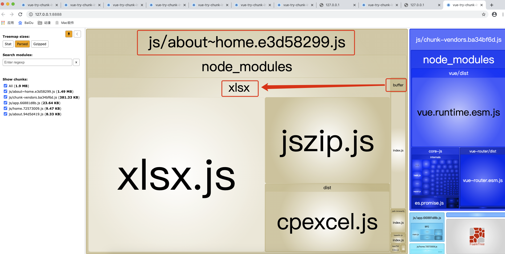
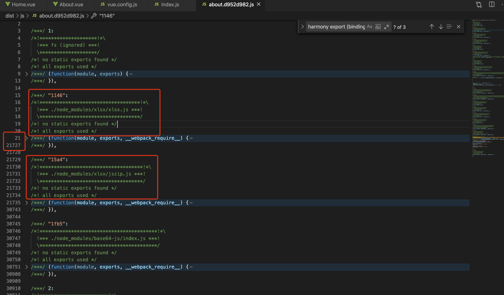
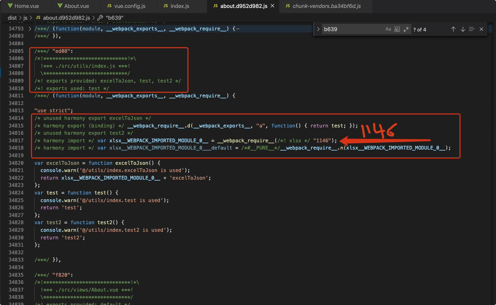
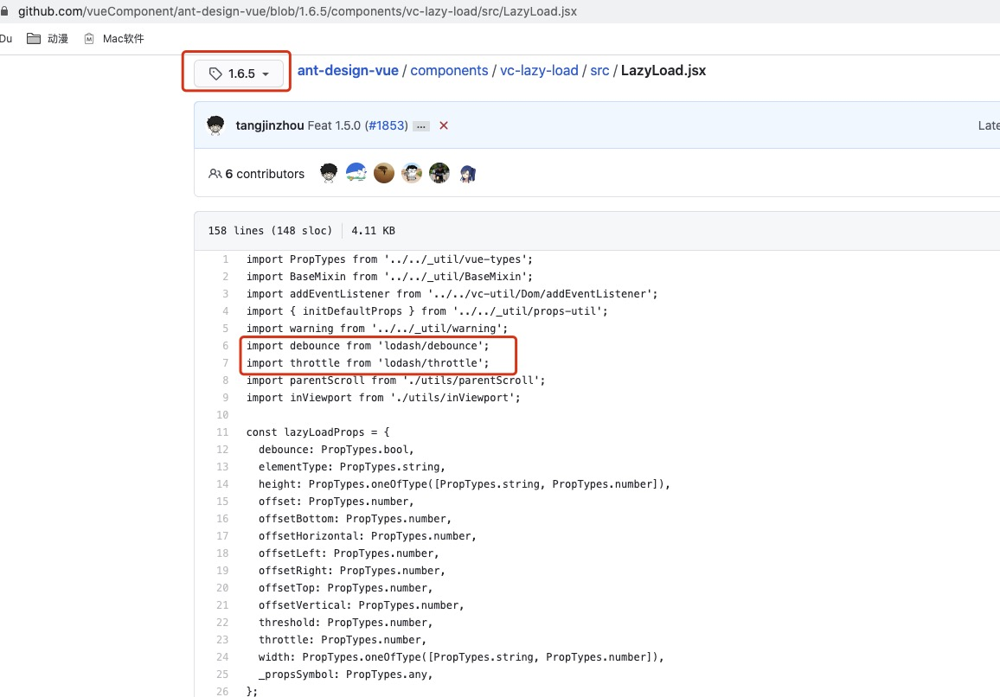
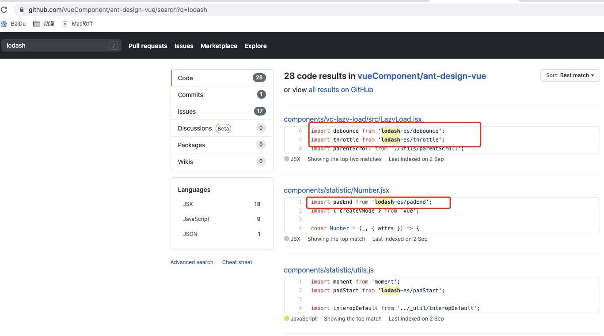
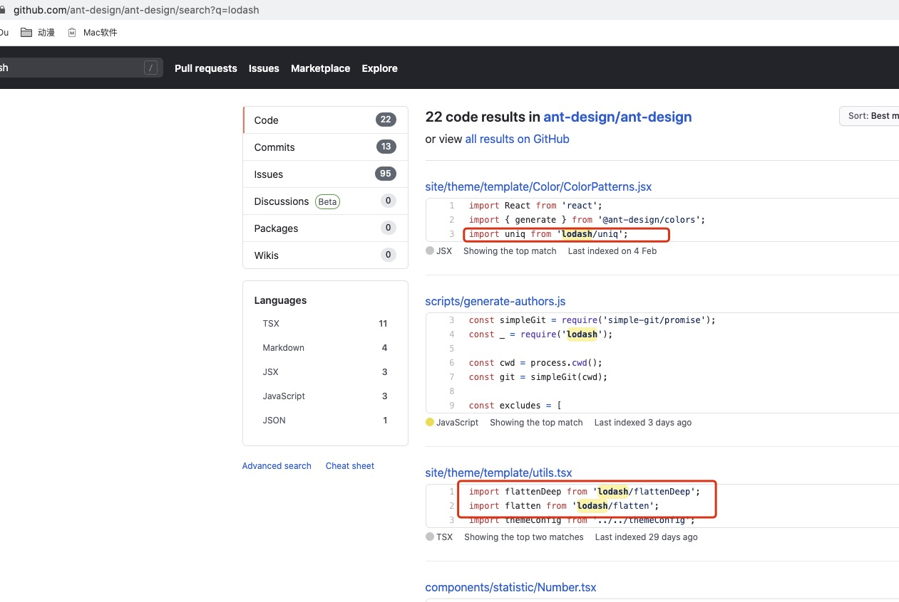

# vue-try-chunk-inital-xlsx

## 🙄 Target 
1. 仅调用test(),为何xlsx会被bundle？
2. 仅调用test(), 为何xlsx出现在vendors中？


环境：vue2、webpack4

实验：@/utils/index中1个xlsx函数，1个test函数。组件仅用test(),为何xlsx会被bundle？为何xlsx出现在vendors中？

代码：@/utils/index.js
```js
import * as XLSX from 'xlsx'

export const excelToJson = () => {
    console.warn('@/utils/index.excelToJson is used')
    return XLSX + 'excelToJson';
}

export const test = () => {
    console.warn('@/utils/index.test is used')
    return 'test'
}

export const test2 = () => {
    console.warn('@/utils/index.test2 is used')
    return 'test2'
}
```

## 🤔 Try 几个场景
### - Try000 没有使用任何`@/utils/index`函数
显然：有`chunk: inital`中的`vue, vue-router, core-js`，没有`xlsx`

截图：


### - Try010 仅`Home.vue`使用`test()`
代码：`Home.vue`
```js
import { test } from '../utils/index.js'

export default {
  name: 'Home',
  created () {
    console.log(test())
  },
}
```
😳 显然：有了`xlsx`。但是并没有使用到`excelToJson()`, 

🤔 猜测：因为webpack4使用了scope-hosing（👺👺👺），`@/utils/index`中涉及的code都会被编译进去

截图：


### - Try020 仅`About.vue`使用`test()`
代码：`About.vue`
```js
import { test } from '../utils/index.js'

export default {
  name: 'About',
  created () {
    console.log(test())
  },
}
```
😳 显然：有了`xlsx`。但是并没有使用到`excelToJson()`, 

🤔 猜测：因为webpack4使用了scope-hosing（👺👺👺），`@/utils/index`中涉及的code都会被编译进去

截图：


## 😘 上面的几个Try，可以证实/推断出一下几点
webpack配置代码
```js
splitChunks: {
  cacheGroups: {
    vendors: {
      name: 'chunk-vendors',
      test: /[\\\/]node_modules[\\\/]/,
      priority: -10,
      chunks: 'initial'
    },
    common: {
      name: 'chunk-common',
      minChunks: 2,
      priority: -20,
      chunks: 'initial',
      reuseExistingChunk: true
    }
  }
},
```

### 🥰 证实1. `chunk: inital`阶段
实例：Try000 Try010 

`chunk: inital`阶段涉及的`node_modules`的文件库会被放到`chunk-vendors.js`中。 在第2点中做解释。


### 🥰 证实2. `chunk: inital`阶段，直接引入 vs 动态引入
实例：Try010

 `Home.vue`发生在`chunk: inital`阶段，因为`router`中`Home.vue`直接引用的，而`About.vue`是动态引用的，所以`xlsx`bundle到`chunk-vendors`

代码：`router/index`
```js
import Vue from 'vue'
import VueRouter from 'vue-router'
import Home from '../views/Home.vue'

Vue.use(VueRouter)

const routes = [
  {
    path: '/',
    name: 'Home',
    component: Home
  },
  {
    path: '/about',
    name: 'About',
    // route level code-splitting
    // this generates a separate chunk (about.[hash].js) for this route
    // which is lazy-loaded when the route is visited.
    component: () => import(/* webpackChunkName: "about" */ '../views/About.vue')
  }
]
```


### 🥰 推测+证实3. 在`initial`阶段，没有发生`minChunks:2`时，跟随最先的component 一起bundle为chunk。 
将`home.vue` 和 `about.vue` 都使用`test()`函数，xlsx应该会 会pack到chunk-vendors.js中（实验成功，因为home.vue 是直接引用）。


### 🥰 证实4. 在`initial`阶段，如何才能发生`minChunks:2` 🤔 
共享

代码：`router/index`
```js
import Vue from 'vue'
import VueRouter from 'vue-router'

Vue.use(VueRouter)

const routes = [
  {
    path: '/',
    name: 'Home',
    // component: Home,
    component: () => import(/* webpackChunkName: "home" */ '../views/Home.vue') // 实验minChunks: 2
  },
  {
    path: '/about',
    name: 'About',
    // route level code-splitting
    // this generates a separate chunk (about.[hash].js) for this route
    // which is lazy-loaded when the route is visited.
    component: () => import(/* webpackChunkName: "about" */ '../views/About.vue')
  }
]

const router = new VueRouter({
  mode: 'history',
  base: process.env.BASE_URL,
  routes
})

export default router
```
代码：`home.vue`, `about.vue` 均使用 `test()`

截图：



📣 📣 Note: 如果将`Home.vue`改成动态引入，就不会发生上面的截图了。


### 🥰🥰🥰 证实5. 单独使用`@/utils/index`中的`test()`也会将`xlsx`打包进去
实例：Try020

证明上面截图中的`xlsx` + `buffer`:
- 代码：             
仅`About.vue`使用`test()`
- 证明图：                 



***虽然`excelToJson()`被标记为`unused` + `harmony export`，将被shaking掉，但是`1146 xlsx`不会干掉。***

## Target 撒花 🌹 🌺 🌻  🌷 🌱 🌲 🌳 🌴 🌵 🌾 🌿 🍀 🍁 🍂 🍃

### 🤔 Target1，仅调用test(),为何xlsx会被bundle？  哈哈哈哈哈哈哈哈哈，你看它引用路径就知道了，引入的路径是真个文件，不是单个test()方法，逗比
被证明了猜测？？ 因为webpack4使用了`scope-hosing`，@/utils/index中的`cmd` 代码会`all export used`全部打进去了？？

- 起初的思考是：使用`esm下的import` 应该只是引用关系，不会发生`cmd 下的require`拷贝代码现象。
- 上面所提，是在js 环境下的代码运行机制；并不是webapck的打包机制。

#### 正果：先bundle ---> 再 Shaking（仅对esm有效）
- bundle过程中，就是将对应的code进行打包。不管你是esm 还是 cmd，所用代码都会bundle。
- 只不过 esm的相关代码，会通过静态结构分析进行标注`unused harmony`, 被 shaking
- webpack4 在针对cmd时，直接给了一个命名空间,并标识 all export，而这部分代码是不会被 shaking的


### 🤔 Target2. 为何xlsx出现在vendors中？
通过Try010、Try020，可知，关键点`chunks: inital`

如果你在入口文件中有直接引入，则被bundle到vendors中（Try010）

如果你没在入口文件中没有直接引入，则不会（Try020）


## 👀👂 自己对上次使用全路径的方法稍微有点迟疑，感谢jinru
### 😘 ant-design-vue-1.x


### 😘 ant-design-vue-2.x


### 😘 ant-design-react


### 🤔🤔 既然已经使用了lodash-es，为啥还在全路径的引入呢？

关于lodash的最佳推荐，有了新感悟，参考实验项目：[webapck4-try-bundle-esm-cmd](https://github.com/ronan-try/webpack4-try-bundle-esm-cmd)

其实[vue-try-chunk-inital-xlsx](https://github.com/ronan-try/vue-try-chunk-inital-xlsx) 与 [webapck4-try-bundle-esm-cmd](https://github.com/ronan-try/webpack4-try-bundle-esm-cmd) 的 webpack config差别不是太大，起初的目的是看vuecli默认的webpack打包效果，而后又模拟了一份配置而已。


### 完结 撒花
🌹 🌺 🌻  🌷 🌱 🌲 🌳 🌴 🌵 🌾 🌿 🍀 🍁 🍂 🍃
