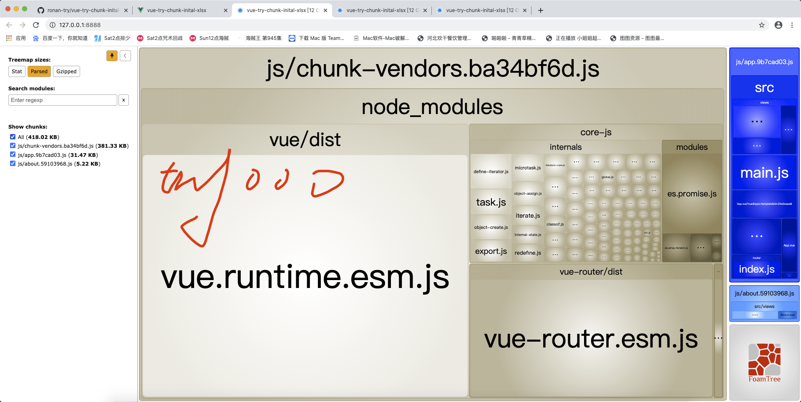
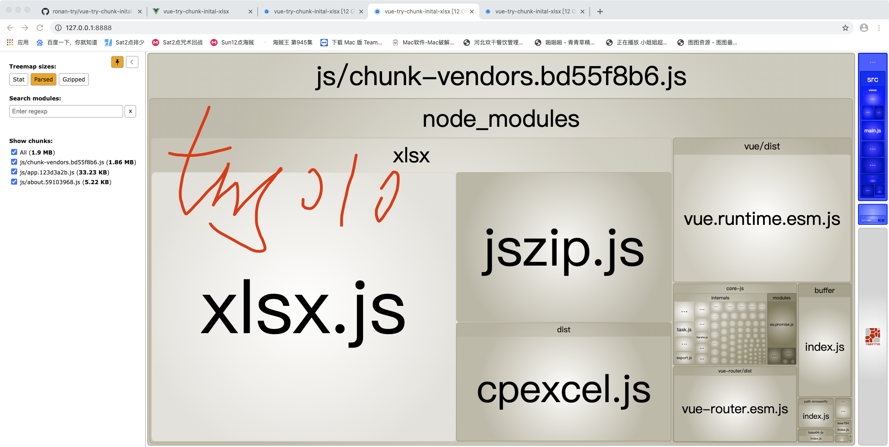
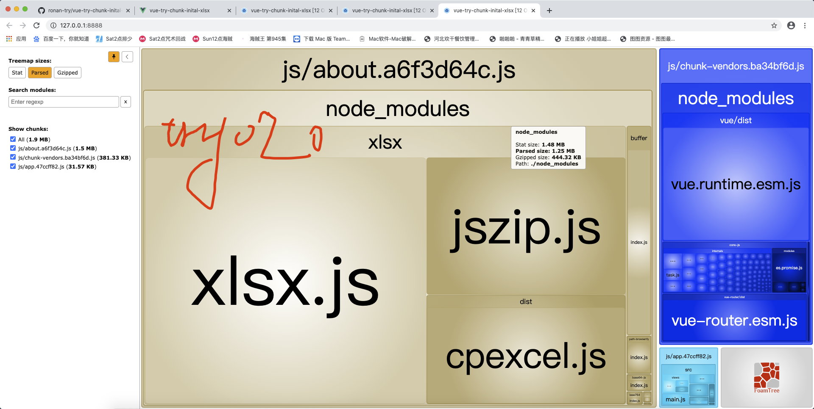

# vue-try-chunk-inital-xlsx

## Target
实验：在@/utils/index 中存在一个自封装的xlsx函数，一个test纯esm函数。HelloWorld.vue引入test(), 为何xlsx会被bundle到vendors中去

@/utils/index.js
```js
import * as XLSX from 'xlsx'

export const excelToJson = () => {
    console.warn('@/utils/index.excelToJson is used')
    return XLSX
}


export const test = () => {
    console.warn('@/utils/index.test is used')
    return 'test'
}
```


### Try000 没有使用任何`@/utils/index.js`
显然：有`chunk: inital`中的`vue, vue-router, core-js`

截图：



### Try010 仅`Home.vue` 使用`test()`
代码：`Home.vue`
```js
import { test } from '../utils/index.js'

export default {
  name: 'Home',
  created () {
    console.log(test())
  },
}
```
显然：有了`xlsx`。但是并没有使用到`excelToJson()`, 所以猜测 在非纯esm下，打包是不一样的？？？

截图：



### Try020 仅`About.vue` 使用`test()`
代码：`About.vue`
```js
import { test } from '../utils/index.js'

export default {
  name: 'About',
  created () {
    console.log(test())
  },
}
```
显然：有了`xlsx`。但是并没有使用到`excelToJson()`, 所以猜测 在非纯esm下，打包是不一样的？？？

截图：



## 通过以上3个Try可以证实/推断出一下几点
1. `chunk: inital`阶段涉及的`node_modules`的文件库会被放到`chunk-vendors.js`中。 在第2点中做解释。
2. `Home.vue`发生在`chunk: inital`阶段，因为`router`中`Home.vue`直接引用的，而`About.vue`是动态引用的。
代码：
```js
import Vue from 'vue'
import VueRouter from 'vue-router'
import Home from '../views/Home.vue'

Vue.use(VueRouter)

const routes = [
  {
    path: '/',
    name: 'Home',
    component: Home
  },
  {
    path: '/about',
    name: 'About',
    // route level code-splitting
    // this generates a separate chunk (about.[hash].js) for this route
    // which is lazy-loaded when the route is visited.
    component: () => import(/* webpackChunkName: "about" */ '../views/About.vue')
  }
]
```
3. `@/utils/index.js`会打包cmd文件库， i.e.`xlsx` ？？？
4. 在没有发生`minChunks:2`时，跟随最先的component 一起bundle为chunk。
将home.vue 和 about.vue 都使用test函数，xlsx应该会 会pack到chunk-vendors.js中（实验成功）。


## Try Target 上面总结中的第3点，为啥没有使用到excelToJson 还会被打包呢？因为包含了esm和cmd？？？
to do


### Customize configuration
See [Configuration Reference](https://cli.vuejs.org/config/).
